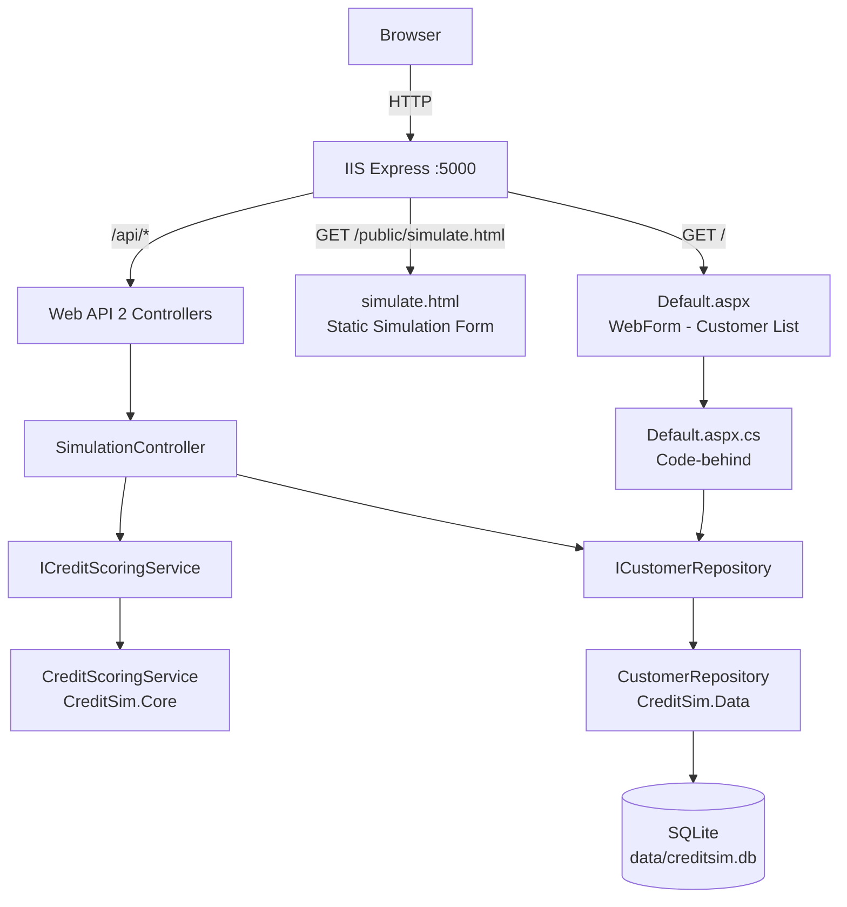
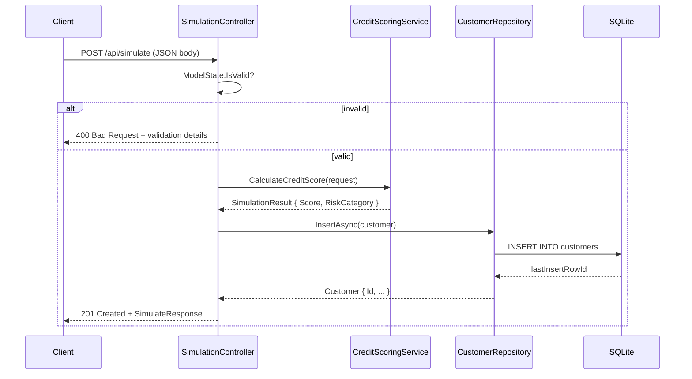
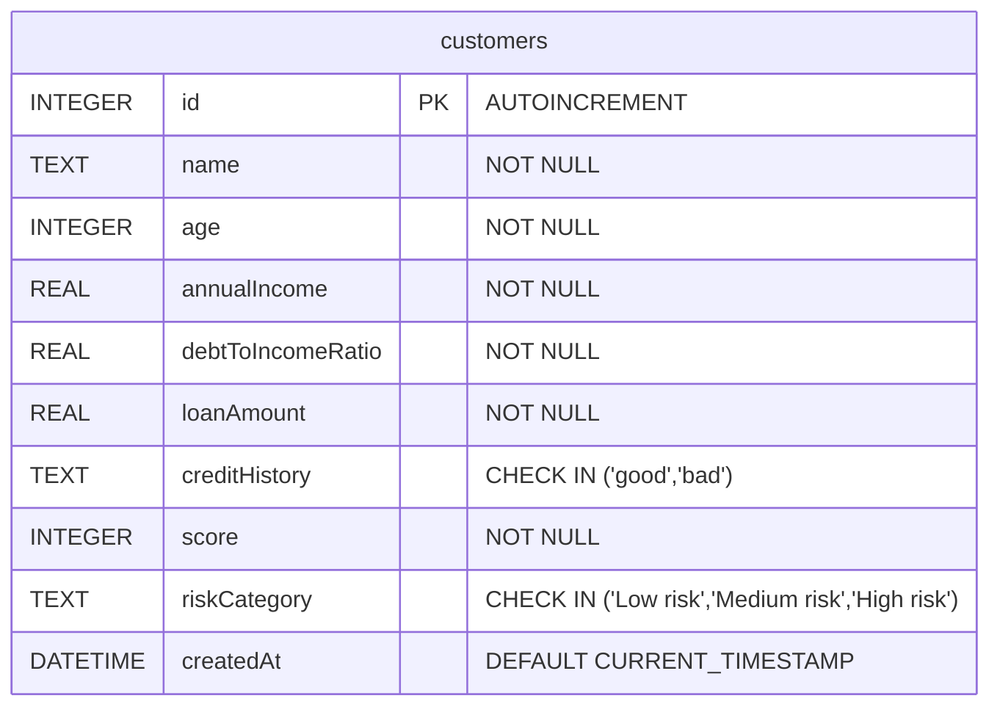

# Architecture

## Solution Structure

```
dotnet/
├── CreditSim.sln
├── src/
│   ├── CreditSim.Core/                  # Business logic & domain models
│   │   ├── CreditSim.Core.csproj        # net472 + net8.0 (multi-targeted)
│   │   ├── Models/
│   │   │   ├── Customer.cs
│   │   │   ├── CreditHistoryValidationAttribute.cs
│   │   │   ├── ScoringCriteria.cs
│   │   │   ├── SimulationRequest.cs
│   │   │   └── SimulationResult.cs
│   │   └── Services/
│   │       ├── ICreditScoringService.cs
│   │       └── CreditScoringService.cs
│   ├── CreditSim.Data/                  # Data access layer
│   │   ├── CreditSim.Data.csproj        # net472
│   │   ├── Repositories/
│   │   │   ├── ICustomerRepository.cs
│   │   │   └── CustomerRepository.cs    # Dapper + System.Data.SQLite
│   │   └── DatabaseInitializer.cs       # Schema creation + seed data
│   └── CreditSim.Web/                   # ASP.NET Web API 2 + WebForms
│       ├── CreditSim.Web.csproj         # net472
│       ├── App_Start/
│       │   └── WebApiConfig.cs          # Routes, CORS, JSON formatting
│       ├── Controllers/
│       │   ├── ConnectionStringProvider.cs
│       │   └── SimulationController.cs  # All /api/* endpoints
│       ├── Models/
│       │   └── ResponseModels.cs        # Strongly-typed DTOs for responses
│       ├── public/
│       │   ├── app.js                   # Frontend JS (unchanged)
│       │   └── simulate.html            # Simulation form (was index.html)
│       ├── Default.aspx                 # Customer list WebForm
│       ├── Default.aspx.cs              # Code-behind with GridView paging
│       ├── Default.aspx.designer.cs     # GridView field declaration
│       ├── Global.asax                  # Application entry point markup
│       ├── Global.asax.cs               # Application_Start, DB init
│       ├── Properties/
│       │   └── launchSettings.json      # IIS Express settings
│       └── Web.config                   # Connection strings, security headers
├── tests/
│   ├── CreditSim.Core.Tests/            # Unit tests (net8.0 + net472, runs in CI)
│   │   ├── CreditSim.Core.Tests.csproj
│   │   └── CreditScoringServiceTests.cs
│   └── CreditSim.Tests/                 # Full test suite (net472, Windows only)
│       ├── CreditSim.Tests.csproj
│       ├── CreditScoringServiceTests.cs
│       ├── SimulationControllerTests.cs
│       └── DatabaseRepositoryTests.cs
└── docs/
    ├── architecture.md                  # This file
    ├── api.md
    └── migration-notes.md
```

---

## Architecture Diagram



---

## Data Flow: POST /api/simulate



---

## Database Schema


